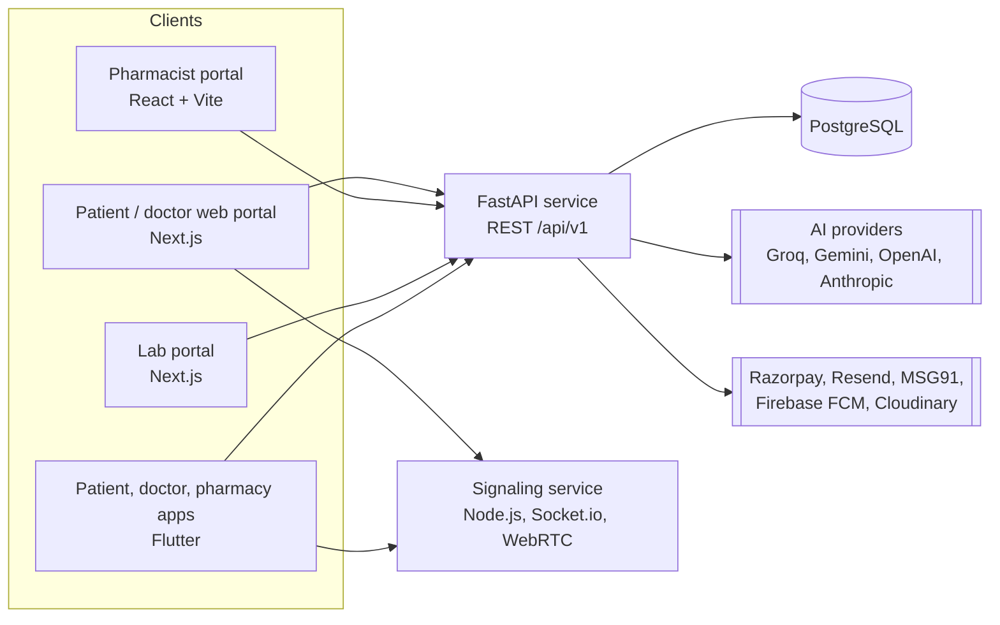

# GramCare AI

**An offline-tolerant, AI-assisted healthcare platform for rural India.**
Patients, doctors, pharmacists, labs, hospitals and health authorities work from one shared record instead of five disconnected ones.

[](https://github.com/anishas1523-1415/GramCare-AI/actions/workflows/main.yml)


> **Status: pre-release.** The platform is deployed and the full test suite and CI pass, but it has not been through a clinical or regulatory review and is **not for use in real patient care yet**. See [Status and known limits](#status-and-known-limits) and the [medical disclaimer](#medical-disclaimer).

---

## Why it exists

A village clinic often has one doctor, patchy mobile data, and no way to know that the pharmacy across the road is out of a drug. GramCare AI is built around those constraints:

- **Works on weak connections.** Triage falls back to an on-device engine when the network or the AI service is unavailable, and the mobile apps tolerate long API cold starts instead of failing at the first timeout.
- **One record, many roles.** A prescription written by a doctor is the same object a pharmacist fulfils and a lab report attaches to.
- **Emergencies are routed, not just logged.** An SOS carries the patient's location and an optional voice note, goes to the nearest hospital, and escalates to the next one if nobody responds.

## Live deployment

| Surface | URL |
|---|---|
| Patient and doctor web portal | https://gram-care-ai.vercel.app |
| Pharmacist portal | https://gramcare-pharmacy.onrender.com |
| Lab portal | https://gramcare-lab.onrender.com |
| API docs (Swagger) | https://gramcare-fastapi.onrender.com/docs |

The backend runs on free hosting tiers, which sleep when idle. **The first request after a quiet period can take up to a minute.** Later requests are fast.

## What it does

| Role | Capabilities |
|---|---|
| **Patient** (web + Android app) | AI symptom triage by text or voice, with an offline fallback · family profiles · book and pay for consultations (Razorpay) · WebRTC video consultation · digital prescriptions · pharmacy and lab-test search and booking · Health Passport with FHIR export · preventive-care reminders · medication reminders · Bluetooth vitals (heart rate, pulse oximeter, thermometer) · SOS |
| **Doctor** (web + Android app) | Verified-doctor onboarding · appointment schedule and patient directory · critical-alert feed · e-prescription writer · referrals · video consultation · AI assistant and clinical decision support |
| **Pharmacist** (web + Android app) | Inventory with expiry and shortage alerts · incoming prescription queue · point-of-sale stock deduction |
| **Lab** (web) | Test catalogue · bookings · report upload |
| **Hospital** (web) | Hospital profile and licence details · receives SOS alerts routed by distance |
| **Health authority** (web) | Doctor verification · community health analytics that surface outbreak clusters from triage data |
| **Community health worker** | Assisted registration and triage on behalf of patients |

## Architecture



The API and the signaling service share one `JWT_SECRET_KEY`, so a token issued at login is accepted by both.

### Repository layout

| Path | What lives there |
|---|---|
| `backend/python_service` | FastAPI app: 20+ domain modules under `modules/`, the AI layer under `ai/`, Alembic migrations, and the pytest suite |
| `backend/node_service` | Socket.io signaling for video calls and realtime alerts |
| `frontend/patient_web_portal` | Next.js portal for patients, doctors, hospitals, government and community health workers |
| `frontend/admin_dashboard` | React + Vite pharmacist dashboard (npm workspace name `react_dashboard`) |
| `frontend/lab_portal` | Next.js lab portal |
| `mobile/patient_app`, `doctor_app`, `pharmacy_app` | Flutter Android apps |
| `shared/api_client` | TypeScript API client shared by the three web apps |
| `docs/` | Audits, roadmap and project reports |

The three web apps are npm workspaces, so install from the repository root.

## AI layer

Triage, the doctor assistant, prescription OCR and doctor summaries all go through one `AIManager` (`backend/python_service/ai/`).

- **Provider chain with failover.** Groq, Gemini, OpenAI and Anthropic are tried in a configurable order (`AI_PROVIDER_PRIORITY`, with per-task overrides such as `AI_PROVIDER_PRIORITY_TRIAGE`). A provider with no key is skipped.
- **Key pooling and circuit breaking.** Several keys per provider can be pooled. Rate-limited keys cool down, and keys with a billing failure or a retired model are set aside instead of being retried on every request.
- **Bring your own key.** A user may supply their own API key in the web app. It is routed only to the provider that issued it, identified by its prefix, and never sent to the others.
- **Honest failure.** If no provider can answer, the API says why (quota, billing, missing model, or no key) instead of returning a fake result that looks real.
- **Diagnostics.** `GET /health/ai` reports live provider state, `GET /health/ai/live` probes each provider, and `GET /health/integrations` shows which of email, SMS, push and payments are truly live or silently mocked.

Every model name is an environment variable (`GROQ_MODEL`, `GEMINI_MODEL`, `OPENAI_MODEL`, `ANTHROPIC_MODEL`), so a retired model is a config change, not a code change.

## Quick start

### Option A: Docker (backend, web portals, database)

```bash
cp backend/python_service/.env.example backend/python_service/.env   # API keys and integrations
printf "JWT_SECRET_KEY=%s\nPOSTGRES_PASSWORD=%s\n" "$(openssl rand -hex 32)" "$(openssl rand -hex 16)" > .env
docker compose up --build
```

`JWT_SECRET_KEY` and `POSTGRES_PASSWORD` are read from the **root** `.env` (or your shell), not from `backend/python_service/.env`, because Compose injects them into both the API and the signaling service so the two always agree.

| Service | URL |
|---|---|
| Patient / doctor web portal | http://localhost:3000 |
| Pharmacist portal | http://localhost |
| API and Swagger docs | http://localhost:8000/docs |
| Signaling | http://localhost:4000/health |

Compose starts PostgreSQL itself and overrides `DATABASE_URL` for the API. Without a root `.env`, both values fall back to publicly known defaults that exist only so `docker compose up` works out of the box; never deploy with them. The lab portal is not part of Compose.

### Option B: run each piece yourself

**Backend**

```bash
cd backend/python_service
python -m venv .venv && source .venv/bin/activate      # Windows: .venv\Scripts\activate
pip install -r requirements-dev.txt
cp .env.example .env                                   # set DATABASE_URL to a PostgreSQL URL
alembic upgrade head
uvicorn main:app --reload --port 8000
```

PostgreSQL is required. There is no SQLite fallback outside the test suite, and the API refuses to start if the database is unreachable.

**Web apps** (from the repository root)

```bash
npm install
npm -w web_portal run dev                 # http://localhost:3000
npm -w react_dashboard run dev            # http://localhost:5173
npm -w lab_portal run dev -- -p 3001      # http://localhost:3001
```

Point the apps at your local API with `NEXT_PUBLIC_API_URL=http://localhost:8000/api/v1` (Next.js) or `VITE_API_URL` (Vite) in a `.env.local`.

**Mobile apps** (Flutter 3.38.5, the version CI pins)

```bash
cd mobile/patient_app        # or doctor_app / pharmacy_app
flutter pub get
flutter run
```

The apps call the hosted API. The base URL is set in `lib/services/api_service.dart`; edit it to use a local backend.

## Configuration

Copy `backend/python_service/.env.example` and fill in what you need. Everything except the database and JWT secret is optional, and each missing integration degrades to a clear no-op rather than a crash. `/health/integrations` tells you which are live.

| Variable | Purpose |
|---|---|
| `DATABASE_URL` | PostgreSQL connection string (required) |
| `JWT_SECRET_KEY` | Signs access tokens; must match the signaling service (required) |
| `GROQ_API_KEY`, `GEMINI_API_KEY`, `OPENAI_API_KEY`, `ANTHROPIC_API_KEY` | AI providers; without any, AI features report that no engine is available |
| `RAZORPAY_KEY_ID`, `RAZORPAY_KEY_SECRET`, `RAZORPAY_WEBHOOK_SECRET` | Payments; without keys, payments run in mock mode with no real charges |
| `RESEND_API_KEY`, `RESEND_FROM_EMAIL` | Password reset and email verification. The sender must be on a domain verified in Resend; the shared sandbox sender delivers only to the account owner |
| `MSG91_AUTH_KEY`, `MSG91_SENDER_ID`, `MSG91_TEMPLATE_ID` | Phone OTP for doctor and hospital registration |
| Firebase service-account JSON | Push notifications (kept out of git, see [Security](#security)) |
| `CLOUDINARY_*` | Image and report storage |
| `CORS_ORIGINS` | Extra allowed web origins; first-party portals are always allowed |
| `SOS_ESCALATION_AFTER_SECONDS` | Wait before an unanswered SOS moves to the next hospital (default 180) |
| `TURN_URL`, `TURN_USERNAME`, `TURN_CREDENTIAL` | TURN relay for video on restrictive mobile networks |
| `GOVERNMENT_WHITELIST_EMAILS` | Emails allowed to register an authority (ADMIN) account |

## Testing and CI

```bash
cd backend/python_service
pip install -r requirements-dev.txt
pytest tests/
```

The suite has about 190 tests covering auth and refresh tokens, AI failover and key pooling, payments, appointments, pharmacy stock, emergency escalation, referrals, FHIR export, the Health Passport and migrations. The suite blanks every provider and storage credential so it never calls a live AI, storage or payment service.

GitHub Actions (`.github/workflows/main.yml`) runs on every push and pull request to `main`:

1. Backend tests against PostgreSQL 15
2. Patient web portal build
3. Pharmacist portal build
4. Lab portal build
5. Debug APK builds for all three Flutter apps, uploaded as artifacts

## Deployment

- **API and signaling:** Render, defined in `render.yaml`. Run `alembic upgrade head` against the production database before deploying a schema change; do not assume a deploy migrates it.
- **Patient web portal:** Vercel, auto-deployed from `main`.
- **Pharmacist portal:** Render static site with an **empty root directory**, build `npm install && npm -w react_dashboard run build`, publish `frontend/admin_dashboard/dist`. Use `npm install`, not `npm ci`: the lockfile is deliberately not committed.
- **New front-end origins:** add the origin to `FIRST_PARTY_ORIGINS` in `backend/python_service/main.py`, otherwise the browser blocks every API call while nothing fails server-side.

## Security

- Role-based access control; bcrypt password hashing; JWT access tokens (lifetime set by `ACCESS_TOKEN_EXPIRE_MINUTES`, 7 days by default) with refresh tokens tracked as server-side sessions.
- Email verification is required before login for every role except patients, and authority accounts can only be registered from an allow-listed email.
- Rate limiting on the AI endpoints (triage, OCR and the live provider probe), keyed per caller.
- No secrets in the repository. `.env` files and Firebase service-account files are gitignored, and the history has been checked for committed keys. The `.env.production` files and `google-services.json` files contain only public client-side values that ship inside every web bundle and APK.
- The patient app keeps its session in the platform secure store and its health-wallet records in an AES-encrypted Hive box. Its reminder and profile caches are not encrypted yet.

To report a vulnerability, please contact the maintainer privately rather than opening a public issue.

## Status and known limits

Honest about what is not finished, because this is a health product:

- **Not clinically validated.** No clinical, regulatory or data-protection review has been done. Treat it as a pilot candidate, not a medical device.
- **Hosting sleeps.** The free tiers spin down when idle, which is unacceptable for an emergency service. Move to always-on hosting before any pilot with real patients.
- **Android builds are debug-signed.** No release keystore is configured yet, so there is no Play Store build.
- **Email and SMS depend on external setup.** Password reset needs a verified Resend sending domain. Phone OTP and non-OTP SMS need MSG91 and TRAI DLT registration.
- **Drug-interaction screening is limited.** It checks a small curated list of pairs. It supplements pharmacist review and never replaces it.
- **Maps use OpenStreetMap.** This needs no API key or billing, but the public tile and Nominatim servers have usage policies that do not suit heavy production traffic. Move to a commercial tile and geocoding provider at scale.
- **Languages.** The web portal ships English and Tamil strings.

Audits and the roadmap are in [`docs/`](docs): [production readiness](docs/audits/PRODUCTION_READINESS_REPORT.md), [technical audit](docs/audits/GramCare_AI_Technical_Audit.md) and the [master roadmap](docs/reports/GramCare_AI_Master_Roadmap.md).

## Medical disclaimer

GramCare AI provides **decision support and information, not diagnosis or treatment**. AI-generated triage, summaries and interaction checks can be wrong, incomplete or out of date. They must not delay emergency care or replace the judgement of a qualified clinician. In an emergency, call your local emergency number.

## Third-party notices

- Map data © [OpenStreetMap](https://www.openstreetmap.org/copyright) contributors, served under the OSM tile and Nominatim usage policies.
- `flutter_blue_plus`, used for Bluetooth vitals, is free only for personal, educational and non-profit use. A commercial release needs a licence for it or a replacement package.

## License

Proprietary. All rights reserved. The source is public for review and evaluation only; no licence is granted to copy, modify or redistribute it without written permission from the maintainer.
